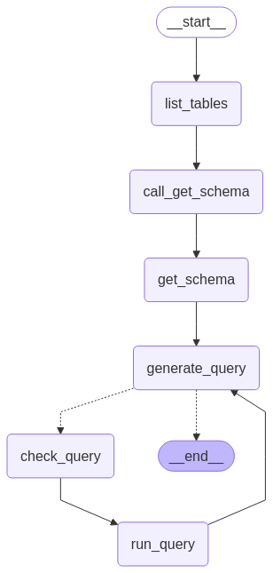

# 🧠 LangGraph SQL Agent

This project demonstrates how to build a powerful **SQL Agent** using [LangGraph](https://github.com/langchain-ai/langgraph) and [LangChain](https://github.com/langchain-ai/langchain). It enables an LLM (like OpenAI's GPT models) to interact with a SQL database through multi-step reasoning, tool use, and error correction

---

## 🚀 Features

- 🔍 **Natural Language to SQL**: Ask questions in plain English and get accurate SQL queries generated and executed
- 📊 **Schema-Aware**: Automatically inspects the database schema before querying
- 🧠 **Multi-step Agentic Reasoning**: Uses LangGraph to allow agents to iterate, check, and fix themselves
- 🔁 **Error Correction**: When queries fail, the agent reflects, debugs, and retries

---

## 🧰 Tech Stack

| Tool        | Purpose                                 |
|-------------|------------------------------------------|
| LangGraph   | Agent Workflow Orchestration Framework |
| LangChain   | LLM framework with SQL support tools     |
| SQLite      | Lightweight ORM database        |
| Python      | Core programming language                |
| OpenAI API  | Language model backend                   |


---

## 🧭 Agent Workflow Explained

<p align="center">
  
</p>


The above diagram illustrates the **LangGraph SQL Agent's reasoning process** — a step-by-step flow enabling natural language to SQL execution through LLM-powered tools:


### 🔄 Step-by-Step Breakdown

- **`__start__`**  
  Entry point of the graph-based agent.

- **`list_tables`**  
  Retrieves a list of all tables in the database to give the agent context about available data.

- **`call_get_schema`**  
  Triggers the retrieval of detailed schema information for specific tables.

- **`get_schema`**  
  Gathers column names, data types, and structure — critical for accurate SQL generation.

- **`generate_query`**  
  The LLM generates a SQL query based on the user's natural language input and the retrieved schema.

- **`check_query`** *(optional validation step)*  
  Evaluates the SQL query. If an error is detected, it loops back to refine or regenerate the query.

- **`run_query`**  
  Executes the generated query on the connected database and collects the result.

- **`__end__`**  
  Final state of the graph. Either returns a successful result or exits gracefully if an issue occurs.

---

## 📁 File Structure

```
├── sql-agent.ipynb        
├── requirements.txt       
└── README.md              
```

---

## 📦 Setup Instructions

1. **Clone the Repository**
   ```bash
   git clone https://github.com/your-username/sql-agent.git
   cd sql-agent
   ```

2. **Install Dependencies**
   You can use `pip` or a virtual environment:
   ```bash
   pip install -r requirements.txt
   ```

3. **Configure Environment Variables**
   Set your OpenAI API Key:
   ```bash
      OPENAI_API_KEY=your-key-here    
   ```


---

## 📝 Example Prompts

- "What is the average salary in the employees table?"
- "List all customers who made a purchase in the last 30 days"
- "How many orders were placed in each region?"

---

## ⚠️ Limitations

- Currently supports **read-only** SQL operations (i.e., `SELECT`)
- For `INSERT`, `UPDATE`, or `DELETE`, you'd need to build custom tools

---

## 🧩 Extending the Project

- Build custom LangChain tools for SQL `INSERT`, `UPDATE`, etc.
- Integrate schema validation for safer write operations
- Add UI with Streamlit

---

